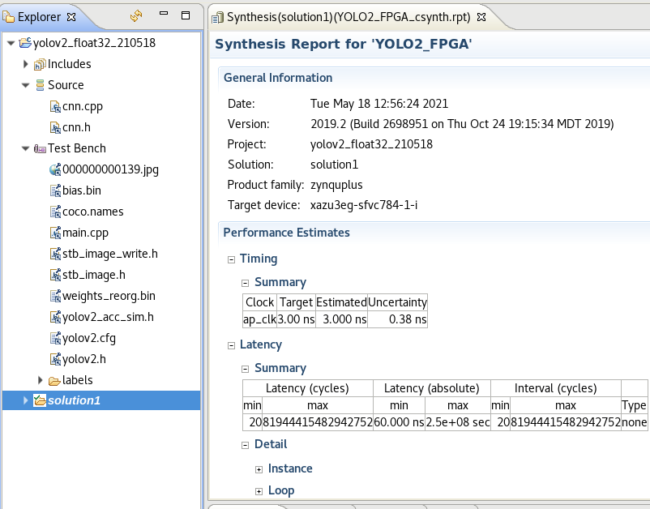
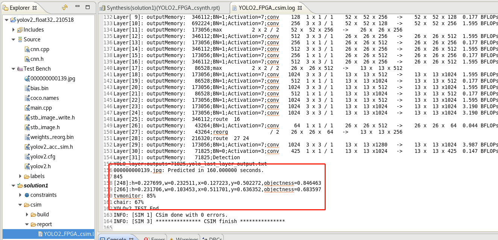

## YOLOv2 Accelerator
This repo is about YOLOv2 accelerator implemented in vivado HLS 2019.2. 

__Target Device:  xazu3eg-sfvc784-1-i__ 

__Target clock: 3__ (Estimated: 3.0 Uncertainty: 0.38; __I just ran it in 250MHz; Off course, it can exe in higher freq.__) 

Current testbench can just pass C-simulation, tb for C-RTL cosimulation maybe need several days. 
~~Some other related files are available from software version foler.~~ If you have finished software version's steps, __All__ related files are included in src_xx repo.
__You can also change the PIPELINE II in CONV compute moudle, I have tested II=1, 2, 3__

__src_int16's c-sim is too slow that I didnt wait for it.__
